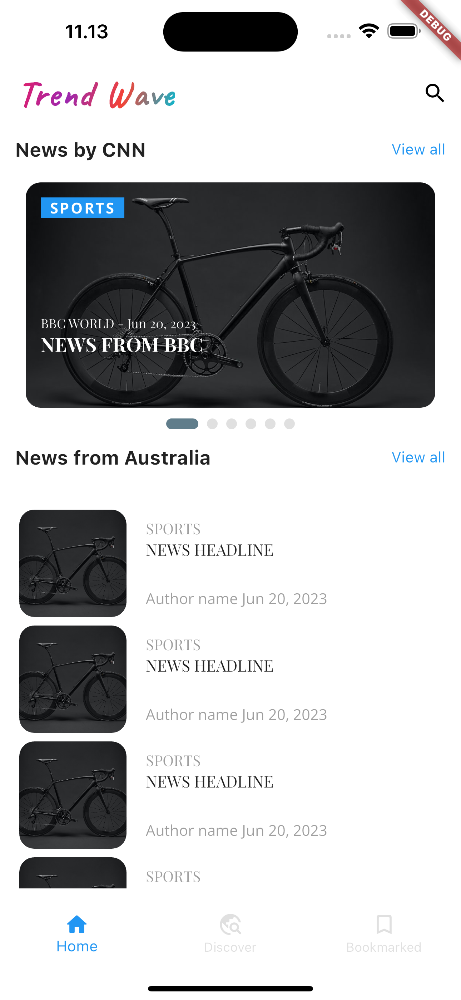
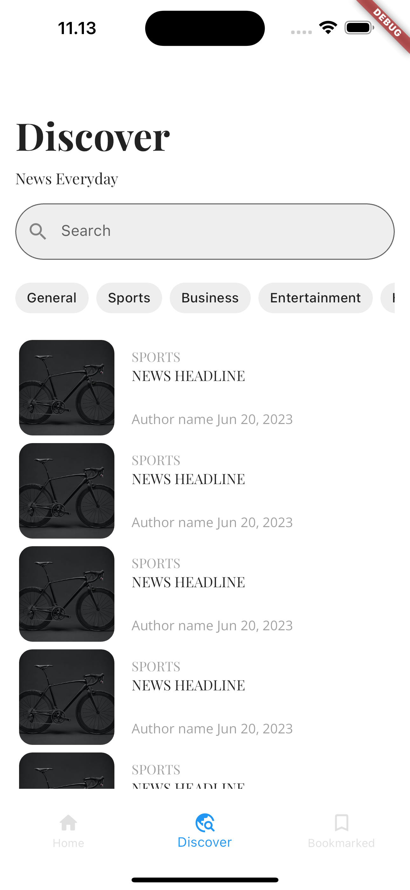
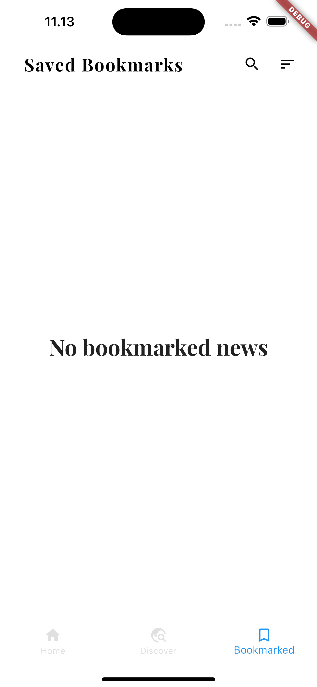

# Trend Wave News App

Trend Wave is a news app that allows users to stay updated with the latest news and trends from various sources. It provides a user-friendly interface for browsing news articles, saving bookmarks, and exploring personalized recommendations.

## Features

- **Breaking News:** Get real-time updates on the latest breaking news from around the world.

- **Personalized Recommendations:** Discover news articles tailored to your interests and preferences.

- **Bookmarking:** Save your favorite articles to read later or refer back to them anytime.

- **Search:** Find specific news articles by searching with keywords or topics of interest.

- **Sorting:** Sort news articles based on different criteria such as date, popularity, or relevance.

## Screenshots

    
  <SizedBox width="40">
   
  <SizedBox width="40">
  

## Technologies Used

- **Flutter:** The app is built using the Flutter framework, enabling cross-platform compatibility for iOS and Android.

- **Google Fonts:** Custom fonts from Google Fonts library are used to enhance the app's typography and visual appeal.

- **HTTP Package:** The app utilizes the HTTP package to fetch news articles from remote APIs.

- **State Management:** Flutter's built-in state management techniques such as `setState` and `Provider` are used to manage the app's state and data flow.

## Getting Started

To run the Trend Wave News app on your local machine, follow these steps:

1. Ensure that you have Flutter and Dart installed on your system.

2. Clone the repository: `git clone https://github.com/ramialkaro/trend-wave.git`

3. Navigate to the project directory: `cd trend-wave`

4. Run the app: `flutter run`

5. The app will be launched on your connected emulator or physical device.

## Contributing

Contributions to the Trend Wave News app are welcome! If you find any issues or have suggestions for new features, feel free to open an issue or submit a pull request.

## License

The Trend Wave News app is released under the MIT License. See the [LICENSE](LICENSE) file for more details.